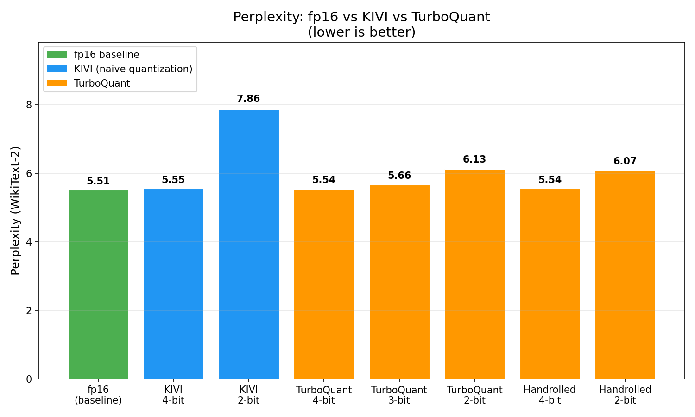

# TurboQuant Experiments

Open-source comparative benchmarks of [TurboQuant](https://arxiv.org/abs/2504.19874) (Google Research, ICLR 2026) applied to autoregressive transformer models. Includes a **from-scratch implementation** of the algorithm with full commentary, validated against the community package.

## What is TurboQuant?

Large language models store a **KV cache** during text generation — cached Key and Value vectors from all previous tokens that the model reads back at each step to compute attention. At long context lengths, this cache can exceed the model weights in memory.

**TurboQuant** compresses the KV cache using two steps:
1. **Random orthogonal projection** — rotates each K/V vector into a new coordinate system where the value distribution is more uniform (flattens outlier channels)
2. **Optimal scalar quantization** — compresses each value to N bits using a codebook optimized for the Beta distribution of unit-sphere-normalized rotated vectors

The projection makes the subsequent quantization much more effective, especially at aggressive compression levels (2-3 bits) where naive quantization fails.

## Results

Evaluated on **Llama-3.1-8B-Instruct**, WikiText-2 test set, autoregressive perplexity (token-by-token generation). Lower perplexity = better.

| Method | Bits | Perplexity | vs Baseline | Tokens/sec |
|---|---:|---:|---:|---:|
| **fp16 (baseline)** | 16 | **5.51** | — | 38.2 |
| KIVI (naive quant) | 4 | 5.55 | +0.04 | 29.4 |
| KIVI (naive quant) | 2 | 7.86 | +2.35 | 29.5 |
| TurboQuant (community) | 4 | 5.54 | +0.03 | 34.4 |
| TurboQuant (community) | 3 | 5.66 | +0.15 | 34.3 |
| TurboQuant (community) | 2 | 6.13 | +0.62 | 34.3 |
| **Handrolled TQ (ours)** | **4** | **5.54** | **+0.03** | 2.1 |
| **Handrolled TQ (ours)** | **2** | **6.07** | **+0.56** | 2.1 |



### Key findings

- **At 4-bit:** All methods are nearly equivalent. Compression doesn't stress any method enough for differences to matter.
- **At 2-bit:** TurboQuant (6.07–6.13) dramatically outperforms naive KIVI (7.86). The random projection trick saves **1.7+ perplexity points** at the same compression ratio.
- **TurboQuant 3-bit is the sweet spot:** PPL 5.66 (+0.15 from baseline) at ~5x KV compression. Almost no quality loss.
- **Our from-scratch implementation matches the community package** — validating the algorithm is correct and reproducible.
- **Throughput:** Community TurboQuant is ~10% slower than fp16 (projection overhead). KIVI is ~23% slower (quanto dequantization overhead). Our handrolled implementation is ~18x slower (pure PyTorch, no optimized kernels — correctness, not speed, was the goal).

### What we learned along the way

1. **Eval methodology matters critically.** Our first attempt used sliding-window perplexity (feeding tokens in bulk), which produced identical perplexity for KIVI and fp16. The reason: KIVI's cache returns original fp16 values during the same forward pass — quantization loss only appears when cached values are read back on subsequent generation steps. Switching to autoregressive eval (token-by-token) fixed this. [Issue log](notes/issue-log.md)

2. **The residual buffer is essential at 2-bit.** Keeping the most recent 128 tokens at full precision (and only quantizing older tokens) dropped our handrolled 2-bit perplexity from 9.33 to 6.07. The model attends most strongly to recent tokens, so protecting them from quantization has outsized impact.

3. **Distribution matters more than you'd expect.** Our first codebook used Gaussian-optimal centroids. The correct distribution for orthogonally-rotated unit vectors is Beta((d-1)/2, (d-1)/2), which is much more concentrated around zero. Switching to the correct codebook was necessary for 2-bit quality.

## Repository structure

```
turboquant-experiments/
├── README.md                              # This file
├── notes/
│   ├── 00-foundations.md                  # Conceptual foundations (attention, KV cache, quantization, JL)
│   ├── 01-kv-cache-reality.md             # KV cache inspection findings on real Llama-3.1-8B
│   ├── 02-what-im-measuring.md            # Why each metric matters
│   ├── 03-results.md                      # Results interpretation
│   ├── issue-log.md                       # Bugs encountered and how they were resolved
│   └── scratch/                           # Pedagogical JL and outlier-flattening demos
├── language-model-improvements/
│   ├── handrolled_turboquant.py           # FROM-SCRATCH TurboQuant (~150 lines, fully commented)
│   ├── kv_utils.py                        # KV cache memory math helpers
│   ├── eval_utils.py                      # Perplexity computation helpers
│   ├── eval_core.py                       # Shared eval functions (autoregressive perplexity, throughput)
│   ├── scripts/
│   │   ├── 01_inspect_kv_cache.py         # Phase 1: inspect KV cache structure
│   │   ├── 02_baseline_eval.py            # Phase 2: fp16 baseline measurement
│   │   ├── 03_turboquant_eval.py          # Phase 3: comparative sweep
│   │   ├── 04_plot_results.py             # Generate comparison plots
│   │   └── 05_combine_results.py          # Combine individual JSONs into summary
│   ├── results/                           # All result JSONs and plots
│   └── tests/                             # Unit tests for helpers and handrolled implementation
└── speech-tts-improvements/               # Part 2: VibeVoice TTS (coming soon)
```

## The handrolled implementation

[`language-model-improvements/handrolled_turboquant.py`](language-model-improvements/handrolled_turboquant.py) is a from-scratch implementation of TurboQuant in ~150 lines of commented PyTorch. It implements:

- **Random orthogonal projection** via QR decomposition of a Gaussian matrix
- **MSE-optimal codebook** for the Beta((d-1)/2, (d-1)/2) distribution (Lloyd-Max quantization)
- **Unit-sphere normalization** (store L2 norm, quantize on the unit sphere)
- **Sliding residual buffer** (most recent 128 tokens at full precision, older tokens quantized)
- **HuggingFace cache interface** compatibility (drop-in replacement for DynamicCache)

It is intentionally not optimized for speed — it prioritizes clarity and correctness. Every step is commented with *why* it works, not just *what* it does.

## Reproduce

Requires a GPU with >= 24GB VRAM (A10G, A100, H100, or similar).

```bash
# Clone and set up environment
git clone https://github.com/MaximusStupidus/turboquant-experiments.git
cd turboquant-experiments
curl -LsSf https://astral.sh/uv/install.sh | sh
uv sync --extra dev
uv pip install optimum-quanto

# Run the full comparative sweep (autoregressive eval, ~5-10 min)
export HF_HOME=/tmp/hf_cache
uv run python language-model-improvements/scripts/03_turboquant_eval.py \
    --model NousResearch/Meta-Llama-3.1-8B-Instruct \
    --output-dir language-model-improvements/results

# Generate plots
uv run python language-model-improvements/scripts/04_plot_results.py \
    --input language-model-improvements/results/summary.json \
    --output-dir language-model-improvements/results/plots

# Run unit tests (CPU, no GPU needed)
uv run pytest language-model-improvements/tests/ -v
```

## Conceptual notes

The `notes/` directory contains the learning journey — written explanations of attention, KV caches, quantization, and the Johnson-Lindenstrauss lemma, plus pedagogical scripts that visualize random projection's dot-product preservation and outlier-flattening properties. These are the foundations that make the implementation make sense.

## Part 2: Parler-TTS (in progress)

TurboQuant applies to any autoregressive transformer with a KV cache — not just text LLMs. Part 2 tests this on **Parler-TTS Mini v1** from HuggingFace, an autoregressive decoder-only TTS model.

**Note on the pivot:** Part 2 originally targeted Microsoft VibeVoice-Realtime-0.5B, but VibeVoice has a cache-API incompatibility with current transformers that requires rewriting its internal `MockCacheLayer`. VibeVoice code is preserved under `speech-tts-improvements/vibevoice/` with a full diagnosis in `notes/part2-vibevoice-blocked.md` for future revival. Parler-TTS answers the same scientific question with a cleanly-maintainable code path.

### Why TTS?

Modern neural TTS models are structurally language models: they have transformer layers, attention, Q/K/V projections, and a KV cache that grows with each generated audio frame. The KV cache compression problem is architecturally identical to the LLM case. If TurboQuant's random projection trick preserves dot products (a domain-agnostic geometric property), it should preserve speech quality the same way it preserves text quality.

### What's different from Part 1

| Aspect | Part 1 (LLM) | Part 2 (TTS) |
|---|---|---|
| Model | Llama-3.1-8B | VibeVoice-Realtime-0.5B |
| Output | Text tokens | Continuous acoustic latents → speech audio |
| Quality metric | Perplexity | UTMOS (naturalness), Speaker Similarity, WER |
| Speed metric | Tokens/sec | Real-time factor (RTF), time-to-first-audio |
| KV cache | 32 layers, 8 KV heads, head_dim=128 | 20 TTS layers, 2 KV heads, head_dim=64 |
| Key question | Does text quality survive? | Does voice identity survive? |

### Architecture

VibeVoice-Realtime-0.5B splits its 24 transformer layers into:
- **Base LM (4 layers):** Processes text only — small cache, not our target
- **TTS LM (20 layers):** Processes text + speech — large, growing cache — **our TurboQuant target**

The model also uses a **diffusion head** (4 layers, not cached) to generate continuous 64-dim acoustic latents at each speech position, and a VAE decoder to convert latents to 24kHz waveform. Only the transformer backbone has a KV cache; TurboQuant targets only that.

### Metrics

| Metric | What it measures | Why it matters |
|---|---|---|
| **UTMOS** | Audio naturalness (1-5 MOS) | Does it still sound human? |
| **Speaker similarity** | Voice identity (cosine sim) | Same person or different? |
| **WER** | Intelligibility (word error rate) | Can you understand the words? |
| **RTF** | Generation speed / audio duration | Is it real-time capable? |
| **Time-to-first-audio** | Latency to first chunk | Does it feel responsive? |

### Design decision: what to quantize

The voice prompt's KV cache captures **speaker identity**. Generated tokens' cache captures **content**. We test two strategies:
- **Safe:** Keep prompt cache at fp16, only quantize generated tokens (preserves identity)
- **Aggressive:** Quantize everything (tests whether identity survives compression)

Full design: [`docs/superpowers/specs/2026-04-14-part2-vibevoice-design.md`](docs/superpowers/specs/2026-04-14-part2-vibevoice-design.md)

## License

MIT
