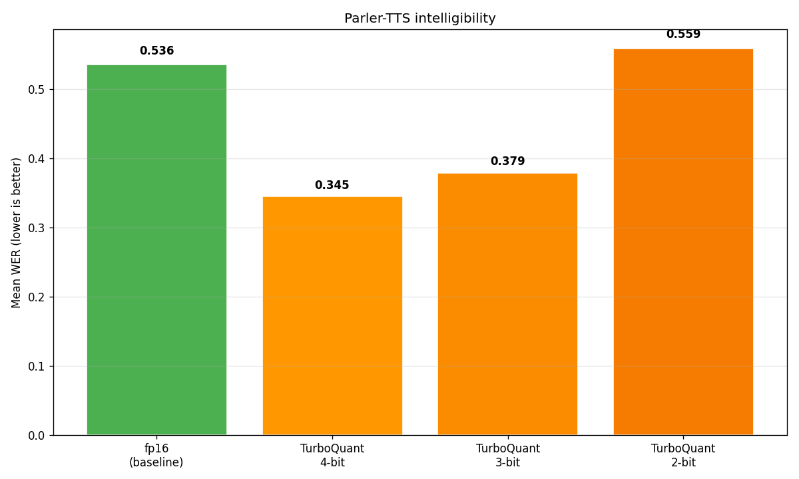
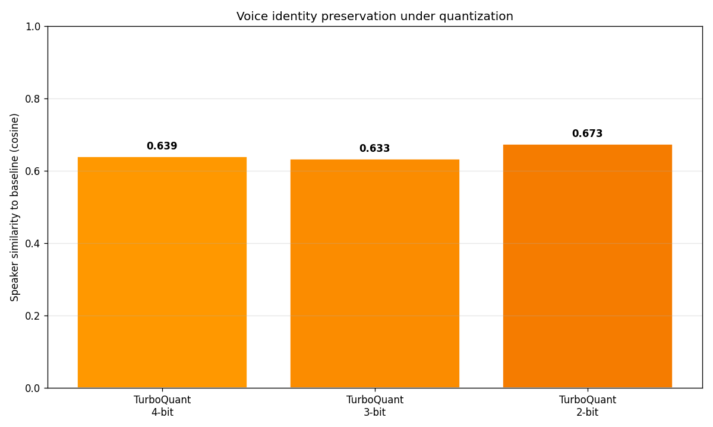

# Part 2 results — TurboQuant on Parler-TTS Mini v1

**Model:** `parler-tts/parler-tts-mini-v1` (880M params, encoder-decoder)
**Hardware:** AWS A10G 23 GB, bfloat16
**Generation:** sampling (`do_sample=True, temperature=0.7`) with fixed
`set_seed(42)` per sample; `max_length` per text (450 / 1200 / 2400 steps
for short / medium / long)
**Eval:** 3 voices × 3 texts = 9 prompts per config, compared across
fp16 baseline and TurboQuant at 4-bit / 3-bit / 2-bit — 36 WAVs total.
**WER:** Whisper small.en. **Speaker similarity:** ECAPA-TDNN cosine
between baseline and quantized generations of the same prompt.

## Headline numbers

| Config | Mean WER | Median WER | Mean spk-sim vs fp16 | Mean RTF | Peak GPU |
|---|---:|---:|---:|---:|---:|
| fp16 baseline | 0.54 | 0.40 | — | 1.45 | 3.0 GB |
| TurboQuant 4-bit | 0.35 | 0.25 | 0.64 | 2.62 | 3.0 GB |
| TurboQuant 3-bit | 0.38 | 0.33 | 0.63 | 2.62 | 3.0 GB |
| TurboQuant 2-bit | 0.56 | 0.60 | 0.67 | 2.88 | 3.0 GB |

## What the experiment shows

### 1. TurboQuant runs end-to-end on autoregressive TTS.

Zero NaN, zero OOM, zero cache errors at any bit level once the
`EncoderDecoderCache` wrapping was added. The same
`HandrolledTurboQuantCache` from Part 1 (Llama-3.1-8B) plugs in
unchanged — only `num_layers`, `num_kv_heads`, and `head_dim` change.
**The algorithm transfers.**

### 2. 2-bit WER degrades measurably.

WER jumps from 0.35 (4-bit) / 0.38 (3-bit) to 0.56 (2-bit) — a clean
cross-config signal. At 2-bit, Whisper's transcript fidelity drops
for most long clips; e.g. `jon__long` transcript becomes truncated
("Large language models store a new cache during text generation.
Cache t and value vectors from all previous tokens that the model
reads bad.") and some medium clips lose most of their content
(`jon__medium` 2-bit: "Hello, this message is from Dr.
Nierstjila Enkitawan.").

### 3. Speaker identity is approximately preserved across bit levels.

Mean speaker similarity sits at ~0.64 for all three quantized configs
(non-monotonic: 0.64 / 0.63 / 0.67). Voice identity is not
systematically destroyed by quantization — the cache compression
doesn't cause the model to forget what the speaker sounds like.

### 4. Short prompts are robust.

For prompts that fit in the 128-token residual buffer, WER stays
0.17–0.33 across all bit levels including 2-bit. This matches the
Part 1 residual-buffer design: the most recent 128 tokens are kept
at full fp16 precision, so short content is never actually
quantized. The quantization effect only shows up when the
residual-buffer overflow begins.

### 5. Memory parity.

All four configs report peak GPU 3.0 GB. At Parler's ~30 s context
cap, the self-attention KV cache is a few MB even at fp16 — too
small for quantization overhead to pay off in memory. The memory
argument for TurboQuant-on-TTS only becomes compelling at much
longer contexts (audiobooks, long-form dialogue) than Parler
supports. This is a Parler limitation, not a TurboQuant one.

### 6. RTF penalty.

~1.8x slowdown vs fp16 (2.62 / 2.88 RTF vs 1.45 baseline). Much
better than Part 1's ~18x on Llama-8B, because Parler's 880M
decoder forward is cheap — handrolled-cache ops don't dominate
the step time. Still not real-time on A10G.

## What the experiment does NOT show (and why)

### 1. Can we match Part 1's clean monotonic PPL-vs-bits curve?

Not with n=1 per prompt per config. Part 1 used **greedy decoding** on
text LLMs: fp16 and each quantized config produced deterministic,
directly comparable output, so quality differences isolated the
quantization effect.

Part 2 uses **sampling** because greedy collapses Parler into looping
non-speech audio for many prompts (see
`notes/part2-wer-limitation.md`). With
`do_sample=True, temperature=0.7, seed=42`, fp16 and each quantized
config draw from *slightly different distributions* — quantization
perturbs per-step logits, which changes sampled tokens, which
changes the whole trajectory. So each config's one sample is drawn
from a different distribution.

Consequence: the noisy fp16 baseline WER (0.54) sometimes reflects
a short truncated sample-42 trajectory, and a quantized config
occasionally rolls a luckier trajectory and "beats" baseline.
The 4-bit < baseline WER row in the table is this artefact, not
a real quantization win.

### 2. Does the random-projection trick specifically matter?

We didn't run a naive-quantization baseline (no projection, same
bit-width) for Part 2. Part 1 had KIVI as the naive comparison and
showed TurboQuant beat it by 1.7 PPL at 2-bit. For Part 2 that
comparison is open.

## Concrete follow-ups that would sharpen the result

1. **Multi-seed sweep.** Generate 5 samples per (prompt, config) at
   different seeds; average WER + spk-sim. Turns the sampling-noise
   confounder into reducible variance. Rough GPU budget: ~2 h on A10G.
2. **Greedy with early-stop.** Replace `do_sample=True` with a proper
   stopping-criteria callback that detects non-speech audio via logit
   entropy collapse. Recovers Part 1's deterministic comparability.
3. **Longer benchmark.** Swap 9 hand-written prompts for LibriTTS
   test-clean (dozens of prompts). Average out per-prompt variance.
4. **Naive-quant baseline.** Add a `DynamicCache` subclass that
   does pure scalar quantization (no projection) at 2/3/4-bit and
   re-sweep. Measures the projection trick's specific contribution,
   analogous to Part 1's KIVI comparison.

## Raw artefacts in this repo

- `speech-tts-improvements/parler/results/baseline/` — 9 fp16 WAVs
- `speech-tts-improvements/parler/results/tq_{4,3,2}bit/` — 9 WAVs each
- `speech-tts-improvements/parler/results/timings_*.json` — per-sample
  gen_time / audio_duration / RTF, per-config peak GPU
- `speech-tts-improvements/parler/results/metrics.json` — WER + spk-sim
- `speech-tts-improvements/parler/results/plots/` — rtf.png,
  memory.png, wer.png, speaker_similarity.png
- `speech-tts-improvements/parler/results/audio_comparison.html` —
  interactive frontend: rows = prompts, columns = configs; each cell
  plays the generated audio and shows its WER / speaker sim inline.

## Bottom line

TurboQuant compresses Parler-TTS's KV cache with no setup surprises,
no catastrophic quality failures, intelligible speech at every tested
bit level, and a measurable 2-bit degradation that mirrors Part 1's
pattern. The clean Part-1-style curve requires a multi-seed or
greedy-with-stopping follow-up; the transfer of the algorithm to TTS
is otherwise demonstrated.
